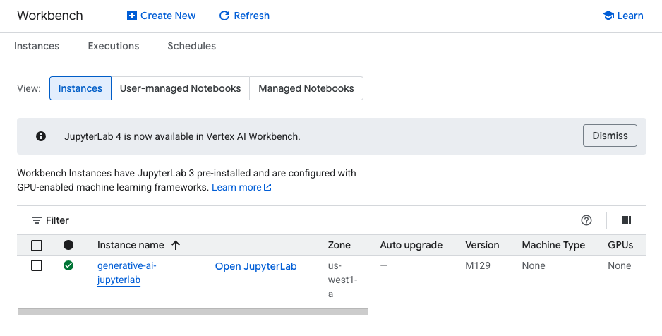
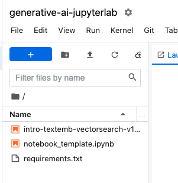
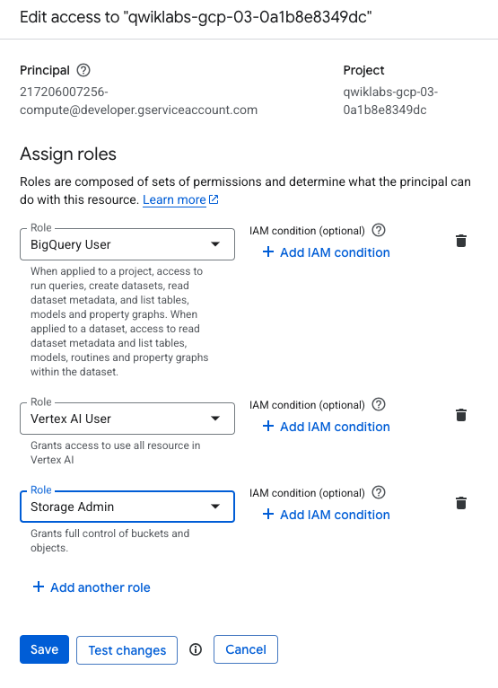
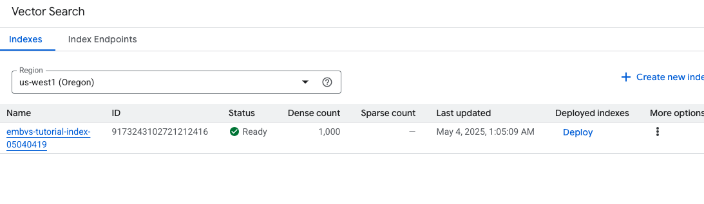
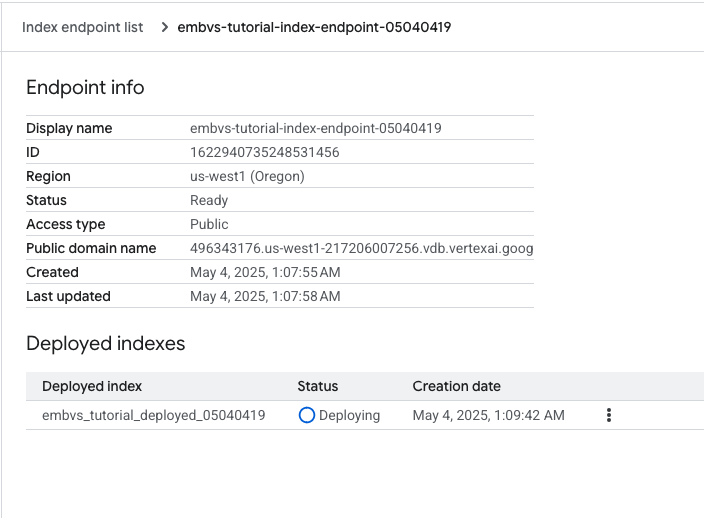
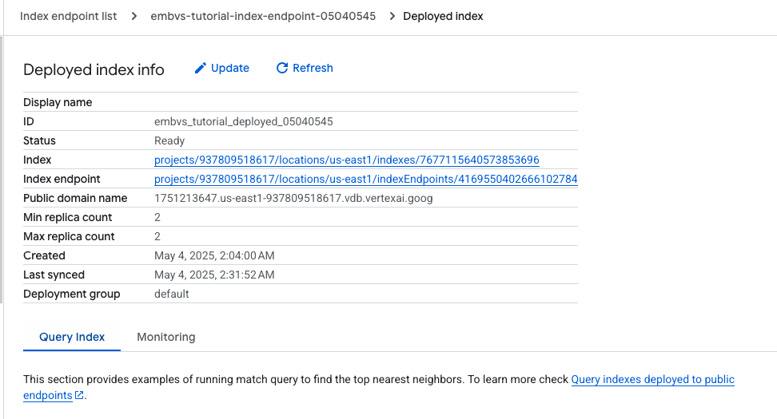
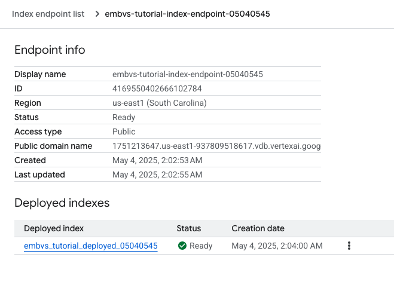

# GCP-LAB-Vector-Search-and-Embeddings
### Getting Started with Vector Search and Embeddings

## Overview
Vector Search can search from billions of semantically similar or semantically related items. A vector similarity-matching service has many use cases such as implementing recommendation engines, search engines, chatbots, and text classification. Semantic matching can be simplified into a few steps. First, you must generate embedding representations of many items (done outside of Vector Search). Secondly, you upload your embeddings to Google Cloud, and then link your data to Vector Search. After your embeddings are added to Vector Search, you can create an index to run queries to get recommendations or results.

The use of embeddings is not limited to words or text. You can generate semantic embeddings for many kinds of data, including images, audio, video, and user preferences. For generating a multimodal embedding with Vertex AI, see Get multimodal embeddings. In this lab, you will learn how to use Vertex AI Embeddings for text to create text embeddings and use them to create a vector search index.


## Objectives
#### In this lab, you will perform the following tasks:

Create a Vertex AI Notebook Instance
Clone and run the lab notebook
Create text embeddings
Create and deploy vector search index
Query the index


## Task 1. Open the notebook in Vertex AI Workbench
1. In the Google Cloud console, on the Navigation menu (Navigation menu icon), click Vertex AI > Workbench.

2. Find the generative-ai-jupyterlab instance and click on the Open JupyterLab button.


The JupyterLab interface for your Workbench instance opens in a new browser tab.

3. In the left panel, double-click the intro-textemb-vectorsearch.ipynb notebook file to open it in the right window.




4. In the Select Kernel dialog, choose Python 3 from the list of available kernels.

5. Scroll down to the Text Embeddings in Action section, and run the setup cells.

#### Install Python SDK
Vertex AI, Cloud Storage and BigQuery APIs can be accessed with multiple ways including REST API and Python SDK. In this tutorial we will use the SDK.

`%pip install --upgrade --user google-cloud-aiplatform google-cloud-storage 'google-cloud-bigquery[pandas]'`

#### Restart current runtime
To use the newly installed packages in this Jupyter runtime, you must restart the runtime. You can do this by running the cell below, which will restart the current kernel.

```#Restart kernel after installs so that your environment can access the new packages
import IPython
app = IPython.Application.instance()
app.kernel.do_shutdown(True)
```

#### Environment variables
Sets environment variables. If asked, please replace the following [your-project-id] with your project ID and run it.


```# get project ID
PROJECT_ID = ! gcloud config get project
PROJECT_ID = PROJECT_ID[0]
LOCATION = "us-west1"
if PROJECT_ID == "(unset)":
    print(f"Please set the project ID manually below")
```


```# define project information
if PROJECT_ID == "(unset)":
    PROJECT_ID = "[your-project-id]"  # @param {type:"string"}

# generate an unique id for this session
from datetime import datetime

UID = datetime.now().strftime("%m%d%H%M")
```

#### Enable APIs
Run the following to enable APIs for Compute Engine, Vertex AI, Cloud Storage and BigQuery with this Google Cloud project.

```! gcloud services enable compute.googleapis.com aiplatform.googleapis.com storage.googleapis.com bigquery.googleapis.com --project {PROJECT_ID}```

#### Set IAM permissions¶
Also, we need to add access permissions to the default service account for using those services.

Go to the IAM page in the Console
Look for the principal for default compute service account. It should look like: <project-number>-compute@developer.gserviceaccount.com
Click the edit button at right and click ADD ANOTHER ROLE to add Vertex AI User, BigQuery User and Storage Admin to the account.


6. When setting your environment variables, use Region for the location, and Project ID for the Project ID.



> Note: you can skip any notebook cells that are noted Colab only.

7. Skip the Set IAM permissions section, as your service account already has the required permissions.


## Task 2. Generate embeddings
Navigate to the Getting Started with Vertex AI Embeddings for Text section and run through the cells to create the text embeddings.

Navigate to the Getting Started with Vector Search section and run through the cells.

Data Preparation
We will be using the Stack Overflow public dataset hosted on BigQuery table bigquery-public-data.stackoverflow.posts_questions. This is a very big dataset with 23 million rows that doesn't fit into the memory. We are going to limit it to 1000 rows for this tutorial.

```
# load the BQ Table into a Pandas DataFrame
from google.cloud import bigquery

QUESTIONS_SIZE = 1000

bq_client = bigquery.Client(project=PROJECT_ID)
QUERY_TEMPLATE = """
        SELECT distinct q.id, q.title
        FROM (SELECT * FROM `bigquery-public-data.stackoverflow.posts_questions`
        where Score > 0 ORDER BY View_Count desc) AS q
        LIMIT {limit} ;
        """
query = QUERY_TEMPLATE.format(limit=QUESTIONS_SIZE)
query_job = bq_client.query(query)
rows = query_job.result()
df = rows.to_dataframe()

# examine the data
df.head()```

|	id	| title
| 0	| 73819683	Show the text form a TextInput in class A in a...
| 1	| 73550113	Codecademy Race Day else statment isn't working
| 2	| 73817386	time complexity of cmp_to_key() ? and how do i...
| 3	| 73668170	Heroku to netlify session wont store session v...
| 4	| 73692728	How do I obtain access to the Keep Supply Cale...


Call the API to generate embeddings
With the Stack Overflow dataset, we will use the title column (the question title) and generate embedding for it with Embeddings for Text API. The API is available under the vertexai package of the SDK.

You may see some warning messages from the TensorFlow library but you can ignore them.

```
# init the vertexai package
import vertexai

vertexai.init(project=PROJECT_ID, location=LOCATION)
```
From the package, import TextEmbeddingModel and get a model.
```
# Load the text embeddings model
from vertexai.language_models import TextEmbeddingModel

model = TextEmbeddingModel.from_pretrained("text-embedding-004")
```

```
import time

import tqdm  # to show a progress bar

# get embeddings for a list of texts
BATCH_SIZE = 5


def get_embeddings_wrapper(texts):
    embs = []
    for i in tqdm.tqdm(range(0, len(texts), BATCH_SIZE)):
        time.sleep(1)  # to avoid the quota error
        result = model.get_embeddings(texts[i : i + BATCH_SIZE])
        embs = embs + [e.values for e in result]
    return embs
```
The following code will get embedding for the question titles and add them as a new column embedding to the DataFrame. This will take a few minutes.

```
# get embeddings for the question titles and add them as "embedding" column
df = df.assign(embedding=get_embeddings_wrapper(list(df.title)))
df.head()
```

	id	title	embedding
0	73819683	Show the text form a TextInput in class A in a...	[-0.014172937721014023, -0.01703040488064289, ...
1	73550113	Codecademy Race Day else statment isn't working	[0.07079033553600311, -0.036748871207237244, -...
2	73817386	time complexity of cmp_to_key() ? and how do i...	[0.03315942734479904, 0.038416724652051926, -0...
3	73668170	Heroku to netlify session wont store session v...	[0.058353617787361145, -0.017031917348504066, ...
4	73692728	How do I obtain access to the Keep Supply Cale...	[0.025912059471011162, 0.05362066626548767, 0....


In the following code, it picks up one question randomly and uses the numpy np.dot function to calculate the similarities between the question and other questions.

```import random

import numpy as np

# pick one of them as a key question
key = random.randint(0, len(df))

# calc dot product between the key and other questions
embs = np.array(df.embedding.to_list())
similarities = np.dot(embs[key], embs.T)

# print similarities for the first 5 questions
similarities[:5]
```

>array([0.27901936, 0.2547825 , 0.29988203, 0.33097578, 0.23214255])


Finally, sort the questions with the similarities and print the list.

```
# print the question
print(f"Key question: {df.title[key]}\n")

# sort and print the questions by similarities
sorted_questions = sorted(
    zip(df.title, similarities), key=lambda x: x[1], reverse=True
)[:20]
for i, (question, similarity) in enumerate(sorted_questions):
    print(f"{similarity:.4f} {question}")
```

>Key question: Log4j vulnerability with org.wso2.carbon.identity.application.authentication.framework
1.0000 Log4j vulnerability with org.wso2.carbon.identity.application.authentication.framework
0.5280 TomEE throws error "Could not find beans for Type=interface ab.cde.fgh.base.fe.login.LoginService and qualifiers:[]
0.5275 Keycloak Identity provider post-broker-login throwing error
0.5139 Vaadin: You are asking Spring Security to ignore... This is not recommended?
0.5125 Access token not propagated in Spring Boot 2.7
0.4962 java.lang.NoClassDefFoundError: Could not initialize class com.sun.xml.ws.api.policy.ModelTranslator
0.4916 Spring Security - Custom matcher to get RegistrationId
0.4891 keycloak impersonation via token-exchange does not work without roles info in the token
0.4810 404 error when upgrading from Tomcat7 / Jersey 2.25 / Servlet 2.5 to Tomcat 10 / Jersey 3.0.8 / Servlet 5
0.4765 Jax-WS RI authentication
0.4693 INVALID_ARGUMENT response when signingBlob using IamCredentialsClient
0.4687 UserDetailsService bean not found
0.4632 How can oauth2 native app loopback redirect secured
0.4556 How can we upgrade our Java 7 code which uses JDBC connection to Cassandra?
0.4524 Jenkins AWS Credentials plugin does not work
0.4510 Can anyone review my JWT authentication code?
0.4497 Keycloak - Using a UUID datatype in Postgres instead of VARCHAR(36)
0.4492 AnyOf in openapi-generator-maven-plugin
0.4491 Graph API is removing certificates from my Enterprise Application in AzureAD
0.4431 Tomcat 8 SocketTimeoutException


Save the embeddings in a JSON file.

First, export the id and embedding columns from the DataFrame in JSONL format, and save it.

```# save id and embedding as a json file
jsonl_string = df[["id", "embedding"]].to_json(orient="records", lines=True)
with open("questions.json", "w") as f:
    f.write(jsonl_string)

# show the first few lines of the json file
! head -n 3 questions.json```


Create a new Cloud Storage bucket and copy the file to it.

gs://qwiklabs-gcp-03-0a1b8e8349dc-embvs-tutorial-05040419


```BUCKET_URI = f"gs://{PROJECT_ID}-embvs-tutorial-{UID}"
! gsutil mb -l $LOCATION -p {PROJECT_ID} {BUCKET_URI}
! gsutil cp questions.json {BUCKET_URI}```

>Creating gs://qwiklabs-gcp-03-0a1b8e8349dc-embvs-tutorial-05040419/...
Copying file://questions.json [Content-Type=application/json]...
- [1 files][  9.8 MiB/  9.8 MiB]                                                
Operation completed over 1 objects/9.8 MiB.  


## Task 3. Create and deploy an index
Navigate to the Create an Index section and run through the cells to create and deploy an index.

> Note: index creation and deployment takes around 20-30 minutes. Feel free to check out the following resources while you wait.


```
# init the aiplatform package
from google.cloud import aiplatform

aiplatform.init(project=PROJECT_ID, location=LOCATION)
```

>Create an MatchingEngineIndex with its create_tree_ah_index function (Matching Engine is the previous name of Vector Search).


```# create index
my_index = aiplatform.MatchingEngineIndex.create_tree_ah_index(
    display_name=f"embvs-tutorial-index-{UID}",
    contents_delta_uri=BUCKET_URI,
    dimensions=768,
    approximate_neighbors_count=20,
    distance_measure_type="DOT_PRODUCT_DISTANCE",
)
```





Creating MatchingEngineIndex
Create MatchingEngineIndex backing LRO: projects/217206007256/locations/us-west1/indexes/9173243102721212416/operations/6129618445420986368


Explore Vector Search and try the demo
In this task, you will explore the Vector search notebook and try the public demo. Since index creation and deployment takes ~30 minutes, you can try the public demo and explore the notebook while you wait.

While you wait: Try the Stack Overflow semantic search demo
The Vector Search public demo is available as a public live demo. Select "STACKOVERFLOW" and enter any coding question as a query, so it runs a text search on 8 million questions posted on Stack Overflow. Try the text semantic search with some queries like 'How to shuffle rows in SQL?' or arbitrary programming questions.
While you wait: Explore the Vector Search notebook
In the notebook, navigate to the Bringing Gen AI and LLMs to production services section at the top and read through the vector search use cases and explanations.


```
# create IndexEndpoint
my_index_endpoint = aiplatform.MatchingEngineIndexEndpoint.create(
    display_name=f"embvs-tutorial-index-endpoint-{UID}",
    public_endpoint_enabled=True,
)
```

>Creating MatchingEngineIndexEndpoint
Create MatchingEngineIndexEndpoint backing LRO: projects/217206007256/locations/us-west1/indexEndpoints/1622940735248531456/operations/6136373844862042112
MatchingEngineIndexEndpoint created. Resource name: projects/217206007256/locations/us-west1/indexEndpoints/1622940735248531456
To use this MatchingEngineIndexEndpoint in another session:
index_endpoint = aiplatform.MatchingEngineIndexEndpoint('projects/217206007256/locations/us-west1/indexEndpoints/1622940735248531456')

```
DEPLOYED_INDEX_ID = f"embvs_tutorial_deployed_{UID}"
```

```
# deploy the Index to the Index Endpoint
my_index_endpoint.deploy_index(index=my_index, deployed_index_id=DEPLOYED_INDEX_ID)
```

>Deploying index MatchingEngineIndexEndpoint index_endpoint: projects/217206007256/locations/us-west1/indexEndpoints/1622940735248531456
Deploy index MatchingEngineIndexEndpoint index_endpoint backing LRO: projects/217206007256/locations/us-west1/indexEndpoints/1622940735248531456/operations/9124512197622366208




## Task 4. Run a query
Navigate to the Run Query section and run through the cells to query the index. You can try changing the string in the test_embeddings variable to see different results.

```
test_embeddings = get_embeddings_wrapper(["How to read JSON with Python?"])
```

100%|██████████| 1/1 [00:01<00:00,  1.17s/it]


```
# Test query
response = my_index_endpoint.find_neighbors(
    deployed_index_id=DEPLOYED_INDEX_ID,
    queries=test_embeddings,
    num_neighbors=20,
)

# show the result
import numpy as np

for idx, neighbor in enumerate(response[0]):
    id = np.int64(neighbor.id)
    similar = df.query("id == @id", engine="python")
    print(f"{neighbor.distance:.4f} {similar.title.values[0]}")
```


>0.7275 Extracting JSON from HTML with BeautifulSoup
0.6757 convert nested json to pandas dataframe of specific format
0.6726 Loading and normalizing JSON and creating Pandas DF Not working
0.6473 How to convert nested numbered list into JSON file using Python?
0.6429 Writing the value of certain keys of a json file to a postgresql table with sqlalchemy
0.5679 Converting dataframe to dictionary
0.5666 Way to remove elements in json file using R
0.5533 How to parse a csv stored as a pandas Series?
0.5516 Get json data from multiple api pages into one main json output
0.5436 From differents columns create a new one with a json format
0.5256 How to dynamically convert JSON to XML with custom namespace?
0.5230 Get a Json file that represents device(object) from a specific folder and generating kafka event
0.5184 How to use an array in extracting values in a pandas dataframe
0.5081 Parse XML response in C#
0.5074 How to call JSONRPC to Odoo API getting data from multiple models in a single request?
0.5048 jq: print key and value for each entry in an object when you have multiple values
0.5017 Scope of variable in for loop python
0.4987 Python scraping hebrew - how to convert string "%d7%a1%d7%99%d7%92%d7%a8" to normal
0.4962 How to query from Cloud SQL with PySpark?
0.4868 Add additional field to response in pytest-django




curl -X POST -H "Authorization: Bearer $(gcloud auth print-access-token)" \
"https://1751213647.us-east1-937809518617.vdb.vertexai.goog/v1/projects/937809518617/locations/us-east1/indexEndpoints/4169550402666102784:findNeighbors" \
-d '{deployedIndexId:"embvs_tutorial_deployed_05040545", "queries":[{datapoint:{"featureVector":"<FEATURE_VECTOR>"}}], returnFullDatapoint:false}'




### Congratulations!
Congratulations! In this lab, you learned how to create text embeddings and use them to create a vector search index. You are now ready to use text embeddings in your own applications!

### Next steps / Learn more
Check out the following resources for more information on text embeddings and vector search:

- [Vertex AI Embeddings for Text: Grounding LLMs made easy](https://cloud.google.com/blog/products/ai-machine-learning/how-to-use-grounding-for-your-llms-with-text-embeddings)
- [Overview of Vertex AI Vector Search](https://cloud.google.com/vertex-ai/docs/vector-search/overview)
- [Vector Search notebook tutorials](https://cloud.google.com/vertex-ai/docs/vector-search/notebooks)
